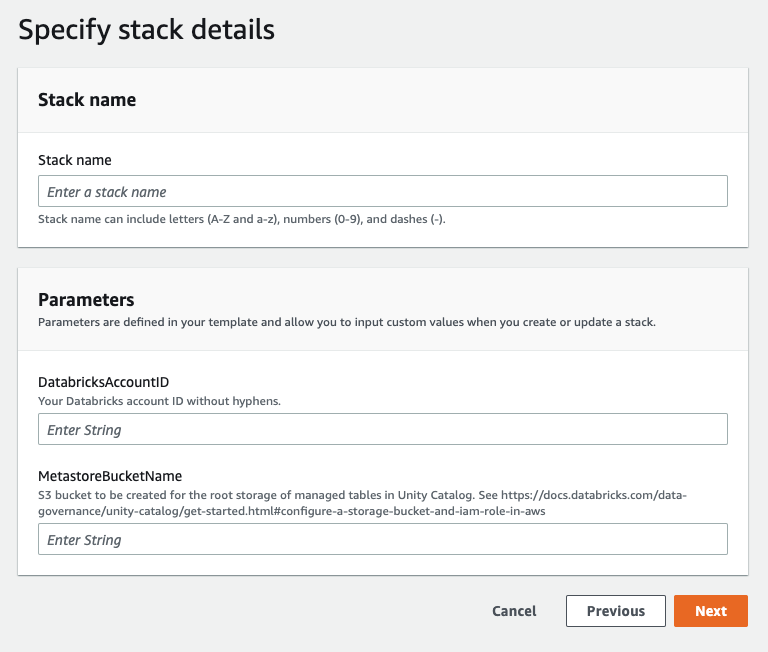

# Unity Catalog Setup

[Unity Catalog](https://docs.databricks.com/data-governance/unity-catalog/index.html) is a unified governance solution for all data and AI assets including files, tables, machine learning models and dashboards in your lakehouse on any cloud. This repository includes resources and guides helpful for setting up Unity Catalog metastores.

Customers should follow instructions from the [official documentation](https://docs.databricks.com/data-governance/unity-catalog/index.html) to [get started using Unity Catalog](https://docs.databricks.com/data-governance/unity-catalog/get-started.html).

## Cloudformation

To get started using Unity Catalog on AWS, you need an S3 bucket and an IAM role. It is required to setup an S3 bucket to be the root storage location for managed tables. You must also set up a cross-account trust relationship so that Unity Catalog can assume a role to access the data in the bucket on behalf of Databricks users. To help with this setup, we have provided two Cloudformation templates.

1. **Without KMS** - [`unity-catalog-setup-template.json`](cloudformation/unity-catalog-template.json) - A template to create the S3 bucket, the IAM role, and the necessary IAM policy. S3 is configured to use server-side encryption using **S3-managed keys**, and _KMS permissions are **not** granted._
2. **With KMS** - [`unity-catalog-setup-kms-template.json`](cloudformation/unity-catalog-kms-template.json) - A template to create the S3 bucket, the IAM role, and the necessary IAM policy. S3 is configured to use server-side encryption using **the provided KMS key**, and _KMS permissions are granted._

### Usage Examples

#### Create a Stack Using the [AWS CLI](https://aws.amazon.com/cli/)

_Prerequisite: [Install and configur the AWS command line interface](https://docs.aws.amazon.com/cli/latest/userguide/getting-started-install.html)_)

**Without KMS**

```bash
aws cloudformation create-stack \
	--stack-name "unity-catalog-stack" \
	--template-url https://raw.githubusercontent.com/databricks/unity-catalog-setup/main/cloudformation/unity-catalog-setup-template.json \
	--capabilities CAPABILITY_IAM \
	--parameters ParameterKey=DatabricksAccountID,ParameterValue=111122223333 \
		ParameterKey=MetastoreBucketName,ParameterValue=unity-catalog-bucket
```

**With KMS**

```bash
aws cloudformation create-stack \
	--stack-name "unity-catalog-stack" \
	--template-url https://raw.githubusercontent.com/databricks/unity-catalog-setup/main/cloudformation/unity-catalog-setup-kms-template.json \
	--capabilities CAPABILITY_IAM \
	--parameters ParameterKey=DatabricksAccountID,ParameterValue=123412341234 \
		ParameterKey=MetastoreBucketName,ParameterValue=unity-catalog-bucket \
		ParameterKey=KMSKeyARN,ParameterValue=arn:aws:kms:us-east-1:111122223333:key/really-long-key-identifier
```

#### Create a Stack Using the AWS Console

1. Log into your AWS console
2. Click into the Cloudformation console
3. Click "Create Stack" then "With new resources (standard)"
4. Paste a link to the raw Cloudformation template to use. E.g., [the template without KMS](https://raw.githubusercontent.com/databricks/unity-catalog-setup/main/cloudformation/unity-catalog-setup-template.json)
5. Follow the prompts on screen for stack name, `DatabricksAccountID`, and `MetastoreBucketName` (and `KMSKeyARN` if using KMS).


